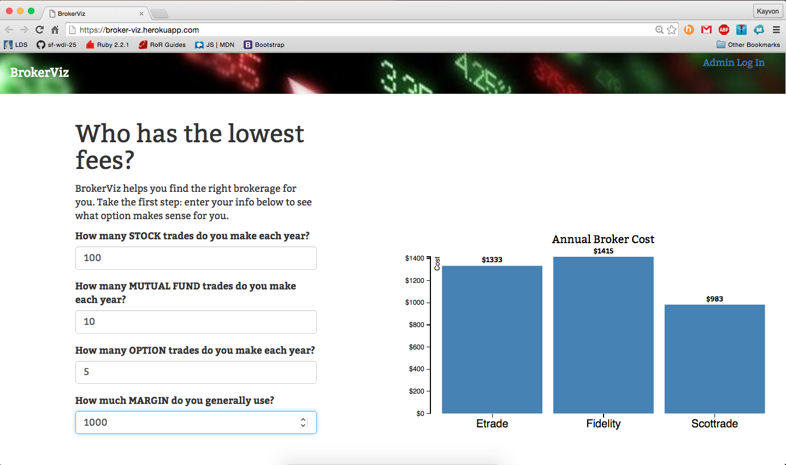
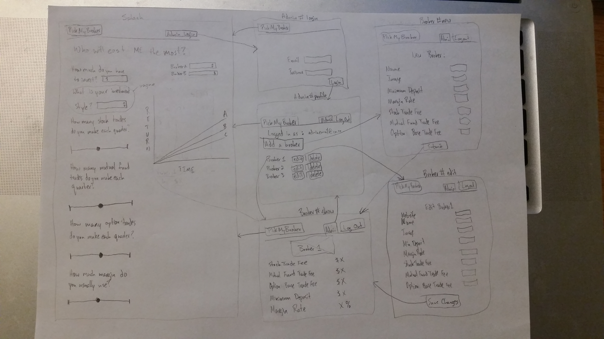
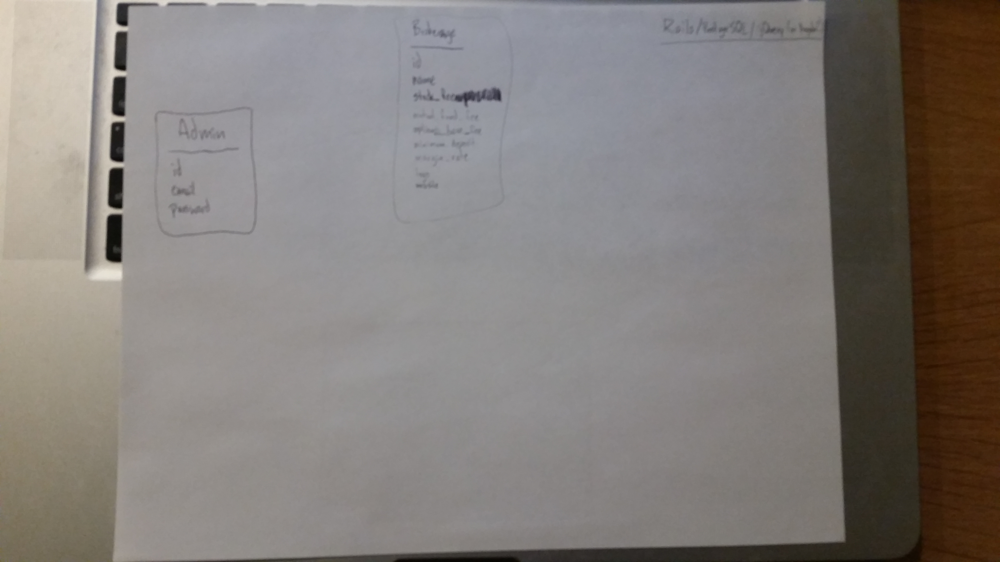

# BrokerViz
BrokerViz is the solution for DIY investors who want to easily compare online broker fees personalized to their trading profiles. The idea was conceived after BrokerViz's lead developer, Kayvon Ranjbar, found himself drowning in tables comparing broker fees for his personal finances. Input just a few metrics and see a cost visualization dynamically appear!

## Contents
* **[Getting Started](#getting-started):** How can you work with the code?
* **[Screenshot](#screenshot):** What does the application look like?
* **[Wireframes](#wireframes):** How did I envision the application's user interface?
* **[User Stories](#user-stories):** How did I plan the features and organize them into sprints?
* **[Heroku Link](#heroku-hosted-project)**
* **[Technologies](#technologies):** What languages, gems, libraries, and frameworks are being used?
* **[Future Development](#future-development):** What am I hoping to add?

# Getting Started
1. Fork this repo and clone it onto your local machine.
2. Change directory into the `broker-cost` directory.
3. Run `bundle install` to install gems.
4. Run `rake db:setup` to create and migrate the database (PostgreSQL must be installed on your machine).
5. Run `rails s` to start the server locally.

# Screenshot

# Wireframes

# User Stories

<a href="https://trello.com/b/K9H4yZU3/brokercost" target="_blank">Trello Board</a>

# ERD

# Heroku hosted project
<a href="https://brokerviz.herokuapp.com/" target="_blank">BrokerViz</a>

# Technologies
* Languages
  * Ruby on Rails
  * JavaScript
  * HTML5
  * CSS3
* Gems/External Libraries
  * D3
  * jQuery
  * bcrypt
  * Bootstrap
* Database
  *  PostgreSQL

# Future Features
* Select specific brokers to compare in chart
* Auto-input values for input fields based on user persona selection
* Choice to see a column chart of costs or a line graph of investment growth/decline
* Sliders replacing input fields
